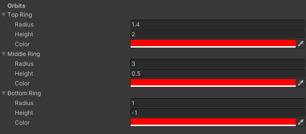
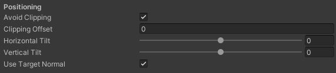

# Unity Third Person Camera

Third person camera behaviour for Unity. Concept was inspired by Unity's [Cinemachine](https://unity.com/unity/features/editor/art-and-design/cinemachine), the code is entirely mine with exception for for the [ShowIfAttribute](./Assets/Scripts/ShowIfAttribute.cs) and [ShowIfAttributeDrawer](./Assets/Editor/ShowIfAttributeDrawer.cs) scripts.  Although inspired by, it is much more simple (and depending on your necessities, much more limitated) than the original Cinemachine scripts. It gives you, however, the possibility to align the normal of the camera plane with the target's normal.

## Summary

- [Unity Third Person Camera](#unity-third-person-camera)
  - [Summary](#summary)
  - [Usage](#usage)
  - [Features](#features)
    - [Orbits](#orbits)
  - [Positioning](#positioning)

## Usage

Paste the [ThirdPersonCamera.cs](./Assets/Scripts/ThirdPersonCamera.cs) and [ShowIfAttribute.cs](Assets/Scripts/ShowIfAttribute.cs) script into your project.

Paste the [ShowIfAttributeDrawer.cs](./Assets/Editor/ShowIfAttributeDrawer.cs) script into any folder named "Editor" in your project.

Attach the ThirdPersonCamera script to your camera and tune the attributes to your needs. Bind the Game Object which the camera should follow to the `follow` property. Bind the Game Object which the camera should look at to the `lookAt` property.

> Note: the camera should not be nested in the `lookAt` nor the `follow` Game Objects.

## Features

### Orbits

The camera uses three different orbits to position itself around the follow target. Each orbit can be configured regarding his height, radius and color in the editor through the inspector:

The height is relative to the transform of the follow target.

The camera circles around the target with a radius that is equal to the quadractic interpolation of the surrounding rings's radius and its height is clamped by the top and bottom rings.

The resulting rings are shwon in the editor like so:

## Positioning

The position of the camera can be further adjusted with the following attributes:

* Avoid Clipping: if enabled, the camera will try to avoid clipping with the ground and other surrouding objects (as long as they have a collider). Defaults to true.
* Clipping offset: the distance between the camera and any clipping object if "avoid clipping" is enabled, defaults to 0.
* Horizontal Tilt: the horizontal angle view offset for the camera. Defaults to 0.
* Vertical Tilt: the vertical angle view offset for the camera. Defaults to 0.
* Use Follow Normal: if enabled, the camera will align its normal with the follow target's normal. Defaults to true.

