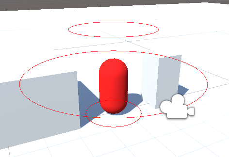

# 🎥 Unity Third Person Camera

Third person camera behaviour for Unity. Concept was inspired by Unity's [Cinemachine](https://unity.com/unity/features/editor/art-and-design/cinemachine), the code is entirely mine with exception for for the [ShowIfAttribute](./Assets/Scripts/ShowIfAttribute.cs) and [ShowIfAttributeDrawer](./Assets/Editor/ShowIfAttributeDrawer.cs) scripts.  Although inspired by, it is much more simple (and depending on your necessities, much more limited) than the original Cinemachine scripts. It gives you, however, the possibility to align the normal of the camera plane with the target's normal.

- [🎥 Unity Third Person Camera](#-unity-third-person-camera)
  - [👾 Usage](#-usage)
  - [🧩 Features](#-features)
    - [🪐 Orbits](#-orbits)
    - [📌 Positioning](#-positioning)
    - [🎮 Controls](#-controls)
    - [✨ Effects](#-effects)
      - [Zoom out on motion](#zoom-out-on-motion)
  - [🐞 Contributing](#-contributing)

## 👾 Usage

Paste the [ThirdPersonCamera.cs](./Assets/Scripts/ThirdPersonCamera.cs) and [ShowIfAttribute.cs](Assets/Scripts/ShowIfAttribute.cs) script into your project.

Paste the [ShowIfAttributeDrawer.cs](./Assets/Editor/ShowIfAttributeDrawer.cs) script into any folder named "Editor" in your project.

Attach the ThirdPersonCamera script to your camera and tune the attributes to your needs. Bind the Game Object which the camera should follow to the `follow` property. Bind the Game Object which the camera should look at to the `lookAt` property.

> Note: the camera should not be nested in the `lookAt` nor the `follow` game objects.

## 🧩 Features

Most features are similar to the original Cinemachine scripts. The only difference is that the camera plane may be aligned with the target's normal. Basic settings can be configured in the inspector to your liking.

### 🪐 Orbits

The camera uses three different orbits to position itself around the follow target. Each orbit can be configured regarding his height, radius and color in the editor through the inspector:

<p align="center">
  
</p>

The height is relative to the transform of the follow target.

The camera circles around the target with a radius that is equal to the quadractic interpolation of the surrounding rings's radius and its height is clamped by the top and bottom rings.

The resulting rings are shwon in the editor like so:

<p align="center">
  
</p>

### 📌 Positioning

The position of the camera can be further adjusted with the following attributes:

| Attribute           |type     | Default value  | Description                                                                                          |
|---------------------|---------|----------------|------------------------------------------------------------------------------------------------------|
| `avoidClipping`     | boolean | `true`         | Defines whether the camera should avoid clipping into objects, see the example below                 |
| `clippingOffset`    | float   | 0              | The distance between the camera and any clipping objects if "avoidClipping" is enabled               |
| `horizontalTilt`    | float   | 0              | The horizontal angle offset for the camera view                                                      |
| `verticalTilt`      | float   | 0              | The vertical angle offset for the camera view                                                        |
| `useTargetNormal`   | boolean | `true`         | If enabled, the camera will align its normal with the follow target's normal, see the example below  |

If `avoidClipping` is enabled, the camera will try to avoid clipping into the ground and other surrouding objects (as long as they have a collider) by moving closer to the follow target. An offset can be applied to move the camera further away from the clipping objects, which can help avoid seeing through objects, however it currently may lead to some glitches regarding the camera position. The following gif illustrates this behavior (true on the left, false on the right).
  
<p align="center">
  
  
</p>

If `useTargetNormal` is enabled, the camera will align it's normal to the follow target's normal, otherwise it will use [Vector3.up](https://docs.unity3d.com/ScriptReference/Vector3-up.html), defined by (0, 1, 0), as shown below (true on the left, false on the right).
  
<p align="center">
  
  
</p>

### 🎮 Controls

| Attribute               |type     | Default value  | Description                                                           |
|-------------------------|---------|----------------|-----------------------------------------------------------------------|
| `horizontalAxis`        | string  | `"Mouse X"`    | Defines the input axis used for the hotizontal movement of the camera |
| `horizontalSensitivity` | float   | 1              | The multiplier for the horizontal input value                         |
| `invertX`               | boolean | `false`        | Defines whether the horizontal movement should be inverted            |
| `verticalAxis`          | string  | `"Mouse Y"`    | Defines the input axis used for the vertical movement of the camera   |
| `verticalSensitivity`   | float   | 0.8            | The multiplier for the vertical input value                           |
| `invertY`               | boolean | `true`         | Defines whether the vertical movement should be inverted              |

### ✨ Effects

A few motion effects are available out of the box. Each can be enabled/disabled and configured as you wish. The effects and configurations avaliable are:

> Although I described this section as available effects (plural), as it is, the only one available is zoom out on motion. I expect to implement more effects in the future, like camera shake. For the time beeing, feel free to contribute!

---

#### Zoom out on motion

**Note: This effect depends on the target having a rigidbody attached to it**.

The zoom out on motion effect is a simple way to make the camera zoom out on the target when the target is moving at certain speeds. This can help giving a sense of depth and speed to the motion. The configurations for this effect are:

| Attribute                |type     | Default value  | Description                                                           |
|--------------------------|---------|----------------|-----------------------------------------------------------------------|
| `zoomOutStartSpeed`      | float   | 10             | At which speed (in m/s) should the camera begin to zoom out           |
| `zoomOutCapSpeed`        | float   | 15             | At which speed (in m/s) should the camera stop to zoom out            |
| `zoomStartDistanceRatio` | float   | 0.1            | How much should the camera zoom out (in %) when it starts to move     |
| `zoomCapDistanceRatio`   | float   | 0.3            | How much should the camera zoom out (in %) when it stops to move      |

The effect is done by increasing the camera and the target by a certain amount, this amount is determined by a linear interpolation of the `zoomStartDistanceRatio` and `zoomCapDistanceRatio` with a value equals to the inverse linear interpolation of the target's speed between `zoomOutStartSpeed` and `zoomCapDistanceRatio`.

For example, suppose we are using the default configurations. If the target is below 10 m/s, the camera will be at it's default distance, as the target increases it's speed beyond 10 m/s, the camera will start to zoom out. At a speed of 12.5 m/s, the inverse linear interpolation value will be 0.5, so the camera will zoom out by a value equals the linear interpolation of the speed at 0.5, that is, 0.2, the equation is:

```
(v * zoomStartDistanceRatio) + ((1 - v) * zoomCapDistanceRatio)
```

with `v = 0.5`. The zoom out amount is represented by the percentage of the default distance that will be added, therefore the camera will zoom out by 20% of the default distance (120% in total).

The result can be seen in the following gif:

<p align="center">
  
</p>

## 🐞 Contributing

Bug reports, feature requests, suggestions (please [create an issue](https://github.com/luizppa/third-person-camera/issues/new)) and pull requests are welcome.
